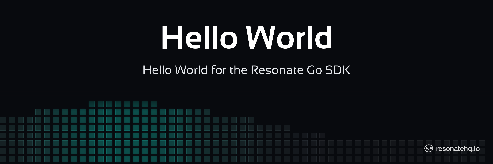

<p align="center">
  <picture>
    <source media="(prefers-color-scheme: dark)" srcset="./assets/banner-dark.png">
    <source media="(prefers-color-scheme: light)" srcset="./assets/banner-light.png">
    
  </picture>
</p>

<p align="center">
  <a href="https://resonatehq.github.io/examples-ci/">
    
  </a>
</p>

# Hello World | Resonate Go SDK

The canonical Resonate program: register a function, invoke it durably, read the result.

> Heads up — `resonate-sdk-go` is pre-release. The SDK has no semver tag yet, so this example pins to a specific commit. Expect API changes until `v0.1.0`.

## What this demonstrates

- Constructing a `*resonate.Resonate` instance against a Resonate dev server.
- Registering a Go function as a Resonate workflow.
- Running it durably via `fn.Run(ctx, id, args)` and reading the typed result.

If a worker crashes mid-execution and restarts, the same durable invocation resumes from where it left off — for a function this simple, you won't see that behavior, but every example in this org builds on the same primitives.

## The code

```go
type GreetArgs struct {
    Name string `json:"name"`
}

func greet(_ *resonate.Context, args GreetArgs) (string, error) {
    return fmt.Sprintf("hello, %s!", args.Name), nil
}

func main() {
    r, err := resonate.New(resonate.Config{URL: "http://localhost:8001"})
    if err != nil { log.Fatalf("resonate.New: %v", err) }
    defer func() { _ = r.Stop() }()

    greetFn, _ := resonate.Register(r, "greet", greet)

    ctx := context.Background()
    id := fmt.Sprintf("hello-%d", time.Now().UnixNano())
    h, _ := greetFn.Run(ctx, id, GreetArgs{Name: "world"})

    out, _ := h.Result(ctx)
    fmt.Println(out) // hello, world!
}
```

`resonate.New` requires one of `Config.URL`, `Config.Network`, or the `RESONATE_URL` environment variable — there is no default URL.

## Prerequisites

- Go 1.22+
- The `resonate` server CLI. Install with Homebrew on macOS or Linux:
  ```
  brew install resonatehq/tap/resonate
  ```
  Other install paths: <https://docs.resonatehq.io/get-started/install>.

## Setup

```sh
git clone https://github.com/resonatehq-examples/example-hello-world-go.git
cd example-hello-world-go
go mod download
```

## Run it

In one terminal, start the dev server:

```sh
resonate dev
```

In another, run the example:

```sh
go run .
```

## What to look for

Expected output:

```
hello, world!
```

The function ran on a durable invocation backed by a promise on the server. You can inspect the promise on the dashboard at <http://localhost:8001>.

## File structure

```
example-hello-world-go/
├── main.go        program entry point
├── go.mod         module declaration + SDK pin
├── go.sum         checksums
├── assets/        README banner images
├── LICENSE        Apache-2.0
└── README.md
```

## Next steps

- **Coming from Temporal?** See [MIGRATING-FROM-TEMPORAL.md](MIGRATING-FROM-TEMPORAL.md) — a side-by-side port of the matching `temporalio/samples-go` example.
- [Get started](https://docs.resonatehq.io/get-started) — install paths + first-program walkthrough.
- [Durable execution concepts](https://docs.resonatehq.io/concepts) — what makes invocations durable + how the runtime resumes them.
- [`example-recursive-factorial-go`](https://github.com/resonatehq-examples/example-recursive-factorial-go) — see what a recursive workflow + worker/client split looks like in Go.

## Community

- Discord: <https://resonatehq.io/discord>
- X: <https://x.com/resonatehqio>
- LinkedIn: <https://linkedin.com/company/resonatehq>
- YouTube: <https://youtube.com/@resonatehq>
- Journal: <https://journal.resonatehq.io>

## License

[Apache-2.0](./LICENSE)
